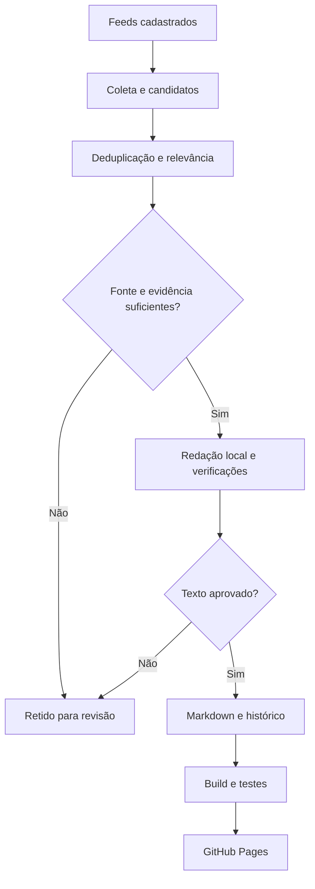

# Eixo Fato

**O fato primeiro. O contexto importa.** Portal de notícias sobre o Brasil e o mundo, com fontes identificadas, texto original e automação editorial conservadora.

## Situação da entrega

- Nova fase editorial: cobertura de Brasil, mundo, política, economia, tecnologia, ciência, cultura, esportes, saúde e meio ambiente.
- Frontend completo, busca, categorias, arquivo, RSS, sitemap e painel de status.
- Fontes oficiais e veículos jornalísticos cadastrados para coleta e verificação.
- Código dos workflows enviado para [`humbertomennella/framenexo`](https://github.com/humbertomennella/framenexo). O repositório está público, o GitHub Pages está configurado e o primeiro deploy foi concluído com sucesso.
- A publicação de revisão em Sites é privada, acessível ao proprietário. Ela é um retrato estático e não recebe futuras edições do GitHub automaticamente.
- Veja `docs/VALIDACAO.md` e `data/deployment-status.json` para distinguir verificações concluídas de etapas pendentes.

## Objetivo e arquitetura

O portal monitora fontes, seleciona acontecimentos relevantes e preserva a origem de cada informação. Ausência de notícias aprovadas é um resultado válido: o sistema não fabrica matérias para preencher uma edição.



Frontend Astro 7.3.1 + TypeScript 7.0.2, HTML semântico, CSS próprio e Markdown. Python 3.12+ usa apenas biblioteca padrão no pipeline. A inferência usa llama.cpp b10831 e Qwen3-4B Q4_K_M, localmente em CPU. Não há chamada à OpenAI nem API com cobrança por token. Node.js 24 e `package-lock.json` fixam o ambiente de build.

## Instalação e execução

Extraia o pacote do projeto em uma pasta própria. Para frontend, use Node.js 24 e Python 3.12+; para automação/modelo, Linux x86_64 ou WSL2, pelo menos 8 GB de RAM e 4 GB livres. Windows nativo pode executar o frontend; o pipeline usa travas POSIX e binário Linux.

```bash
npm ci
npm run dev
npm run build
npm run preview
npm test
npm run check:site
```

`npm run check:site` exige um build anterior. O modelo não é necessário para construir ou ler o site.

```bash
# Coleta real; não publica matérias
npm run collect

# Instala e verifica aproximadamente 2,5 GB de pesos
python3 scripts/local_model.py install

# Fluxo completo, respeitando a janela de uma hora
python3 scripts/run_editorial.py

# Considera uma edição imediatamente, mantendo os filtros factuais
python3 scripts/run_editorial.py --force

# Rascunhos aprovados em .cache, sem publicar nem avançar o relógio
python3 scripts/run_editorial.py --force --dry-run --limit 1

# Teste de um candidato real específico, sem publicação
python3 scripts/verify_model.py ID_DO_CANDIDATO
```

Para usar `npm run publish` separadamente, inicie `python3 scripts/local_model.py serve` em outro terminal. O comando integrado inicia e encerra seu próprio modelo. `LLAMA_SERVER` aceita somente HTTP em loopback; o padrão é `http://127.0.0.1:8080`.

## Estrutura

| Caminho | Função |
|---|---|
| `content/news/` | Matérias Markdown, frontmatter JSON compatível com YAML |
| `src/pages/`, `src/layouts/`, `src/components/` | Páginas estáticas, layout e cards |
| `src/styles/global.css` | Tokens de marca e regras responsivas |
| `data/sources.json` | Cadastro central das fontes |
| `data/candidates.json` | Metadados dos candidatos, relevância e estado |
| `data/publishing-state.json` | Última edição, pausa e histórico |
| `data/editorial-log.json` | Registro rotativo das últimas 500 operações |
| `data/evidence/` | URLs, hashes, afirmações verificadas e resultado da revisão |
| `data/image-rights.json` | Origem e situação de uso das imagens |
| `data/model-lock.json` | Versões, URLs e SHA-256 do motor e dos pesos |
| `scripts/` | Coleta, classificação, verificação, redação, publicação e validação |
| `.github/workflows/` | Coleta, publicação manual, testes, deploy e avisos |
| `.cache/` | Textos brutos, modelo, rascunhos e diagnóstico local; ignorado pelo Git |

## Fontes e coleta

Há 12 fontes cadastradas, seis com feed: IBGE, NASA Science, Nações Unidas, Organização Mundial da Saúde, Agência Brasil e DW Brasil. Portal Gov.br, Banco Central, Câmara, Senado, UNESCO e Ministério do Meio Ambiente permanecem como referências editoriais. Habilitar o cadastro não prova disponibilidade de uma fonte; os registros informam quais responderam.

A rotina aceita RSS/Atom, mantém até 2.000 candidatos e ignora itens sem data, futuros ou com mais de sete dias. Links só podem usar HTTPS e hosts previamente aprovados. Não existe contorno de bloqueio, autenticação, paywall ou CAPTCHA. Falhas temporárias recebem até três tentativas limitadas; uma fonte indisponível não invalida as outras.

Cada candidato registra título original, fonte, URL, datas em UTC, assunto, categoria, indicação interna, relevância, confiança e estado. Textos integrais não entram no site nem no repositório. Uma falha geral da coleta é sinalizada como falha da execução.

## Publicação e qualidade

O cron `17 * * * *` apenas desperta o processo aproximadamente a cada hora. A condição real é `agora - lastPublishedAt >= 36.000 segundos`. Uma edição vazia não avança esse horário. O tempo é medido em UTC e apresentado no site em horário de Brasília. Datas de fontes sem horário são tratadas como datas, sem inventar uma hora.

Duplicatas são agrupadas por URL normalizada e semelhança de acontecimento. Uma segunda avaliação do modelo compara o evento com o histórico publicado. Matérias existentes também são lidas diretamente para impedir repetição após uma interrupção entre gravação de arquivo e estado. Comparação semântica por IA é imperfeita; revisão posterior continua necessária.

Somente candidatos de fonte primária, com relevância mínima de 65 e evidência suficiente podem entrar na publicação automática. Rumores, análises, prévias e relatos de experiência ficam para revisão. Imprensa especializada é coletada, mas não publicada automaticamente sem uma etapa editorial adicional.

O modelo recebe texto isolado como dado não confiável, sem ferramentas. A redação tem título, resumo, parágrafos, referências factuais e tags. Verificações controlam formato, extensão, números sem apoio na fonte, cópia de trechos e saída potencialmente executável. Uma segunda passagem avalia sustentação factual, português, originalidade e duplicação. **Essa passagem usa o mesmo modelo: não é confirmação independente nem garantia de precisão.**

Há no máximo 15 candidatos por execução e um orçamento editorial de 30 minutos. Candidatos ainda não processados permanecem na fila. Não há quantidade mínima. A rotina preserva conteúdo válido e não faz rollback destrutivo.

## GitHub e Pages

A conta identificada nesta sessão foi `humbertomennella`. O repositório público dedicado já foi criado e recebeu o projeto. Para reinstalações em outra conta, existe um script de instalação local que cria **apenas um novo repositório público dedicado**, ativa Pages quando permitido e envia o projeto:

```bash
# No seu computador, com GitHub CLI instalado
gh auth login
python3 scripts/bootstrap_github.py --owner humbertomennella --repo framenexo
```

Ele aborta se a conta não corresponder ou se o repositório já existir. Não modifica outros repositórios, configurações globais, domínio ou planos. Se Pages não for ativado pela API, selecione **Settings → Pages → Build and deployment → Source → GitHub Actions** no novo repositório.

Após o primeiro deploy, confirme a URL retornada pela execução e registre a ativação em `data/deployment-status.json`.

O endereço do Pages é `https://humbertomennella.github.io/framenexo/`. O workflow configura `SITE_URL` com a origem do proprietário e `BASE_PATH` com o nome do repositório. `astro.config.mjs` admite as mesmas variáveis no ambiente local; `.env.example` documenta os valores. Para mudar domínio, obtenha autorização antes de alterar essa configuração.

## Workflows e permissões

| Workflow | Disparo e comportamento | Permissões necessárias |
|---|---|---|
| `collector.yml` | Horário, manual ou reutilizável; coleta, edição, validação, commit e deploy explícito | Escrita de conteúdo no job editorial; Pages e OIDC apenas no deploy |
| `publisher.yml` | Manual; pode antecipar a janela sem relaxar verificações | Permissões repassadas aos jobs reutilizáveis |
| `deploy.yml` | Push em main, manual ou chamada com SHA exato | Leitura de conteúdo; leitura de Pages no build; escrita de Pages e OIDC na publicação |
| `tests.yml` | Pull request ou manual | Leitura de conteúdo |
| `notify.yml` | Falha de execução confiável em main | Leitura de conteúdo e escrita de issues |

Os pushes com `GITHUB_TOKEN` não dependem de disparar outro workflow: o coletor chama o deploy reutilizável explicitamente com o SHA que acabou de enviar. Concorrência por projeto evita sobreposição e cancelamento de uma edição em andamento. Nenhum commit vazio é criado. Se a edição falha, os logs podem ser preservados após validação, e a falha continua sinalizada.

Actions de terceiros usam SHA completo. Dependabot propõe atualizações mensais de npm e Actions, sem merge automático. Os jobs ficam desabilitados em repositórios privados para evitar consumo acidental de minutos pagos.

## Secrets e custos

Não é necessário criar nenhum secret adicional. `GITHUB_TOKEN` é temporário e fornecido pelo GitHub; é disponibilizado somente nas etapas que precisam usá-lo. Nunca coloque PAT, senha ou chave em arquivos, commits ou mensagens.

Não foi contratado serviço pago. Os runners padrão de repositórios públicos têm execução gratuita; runners maiores geram cobrança e não são utilizados. Artifacts compartilham a franquia de armazenamento da conta: a retenção foi limitada a um dia, mas a franquia disponível precisa ser conferida antes da ativação. Nenhum limite pago de cache ou armazenamento é ampliado por este projeto. Consulte a [documentação de cobrança do GitHub Actions](https://docs.github.com/en/billing/concepts/product-billing/github-actions).

O modelo usa CPU, download público e arquivos locais. Ele pode levar minutos por matéria. Disponibilidade e termos dos provedores externos podem mudar. Qualquer migração para API paga, plano pago ou recurso maior exige autorização prévia.

## Operação e manutenção

**Pausar:** execute `python3 scripts/pipeline.py pause`, faça commit de `data/publishing-state.json` e envie para main. Isso interrompe coleta e publicação na rotina integrada. Também é possível desabilitar “Coleta e edição” em Actions. **Retomar:** `python3 scripts/pipeline.py resume`, commit e push.

**Publicação manual:** use Actions → Publicação manual → Run workflow. A opção `force` antecipa apenas o relógio; não ignora pausa nem critérios de qualidade.

**Adicionar fonte:** inclua identificador único, nome, tipo, URL, feed, hosts exatos e categoria em `data/sources.json`. Verifique a origem, disponibilidade do feed e permissões de uso antes de habilitar. Faça uma coleta local e inspecione o log. Não acrescente domínios genéricos ou hosts de usuário à lista de confiança.

**Corrigir matéria:** edite o Markdown existente, preserve `publishedAt`, altere `updatedAt` e acrescente uma nota em `corrections` quando a mudança for factual. Rode testes, build e verificação de site antes de enviar. Não apague o histórico.

**Revisar candidato retido:** investigue a fonte e o diagnóstico; corrija a causa. Só volte seu status a `candidate` após resolver o problema. Notícias de fonte secundária, análises e rumores precisam de autoria/revisão editorial específica; mudar somente o status não os torna elegíveis.

**Alterar marca:** ajuste tokens e wordmark, o favicon, as imagens autorizadas e seus registros de uso; veja `docs/MARCA.md`. Refaça a metadata do compartilhamento quando mudar o título ou a arte. Atualizações do motor/modelo exigem nova versão, SHA-256 e teste factual.

**Notificações:** falhas geram uma issue identificada pela execução, com ação necessária, motivo, impacto, risco e alternativa. Habilite notificações do próprio repositório no GitHub para recebê-las. O sistema não presume que o aviso foi lido e não aprova custos ou permissões sozinho.

**Agendamento:** GitHub pode atrasar ou suspender execuções agendadas, inclusive por inatividade do repositório. Consulte a [documentação de eventos agendados](https://docs.github.com/en/actions/reference/workflows-and-actions/events-that-trigger-workflows#schedule). O painel é um retrato do build, não monitoramento em tempo real; compare a última coleta com o relógio e consulte Actions.

## Troubleshooting

| Sintoma | Diagnóstico e ação |
|---|---|
| Nenhuma nova matéria | Verifique janela de uma hora, pausa, relevância, mídia aprovada e estados retidos. Não é necessariamente erro. |
| Timeout/403 de fonte | Consulte a fonte e seu feed; não contorne bloqueios. Outras fontes continuam. |
| Falha de checksum | Não execute o arquivo baixado. Confira versão e origem; atualize o lock somente após validação. |
| Modelo sem memória ou indisponível | Use Linux x86_64, RAM suficiente e loopback. Não mude para API paga automaticamente. |
| `invalid_headline`, `unsupported_number`, `verifier_rejected` | Texto retido. Inspecione `.cache/drafts/`, confirme a fonte e corrija o redator sem desativar controles factuais. |
| Pages 404 / assets quebrados | Confira Source=GitHub Actions, conclusão do deploy, nome do repositório, `SITE_URL` e `BASE_PATH`. |
| Push recusado | Confira permissões do repositório e conflitos em main. Nunca use push forçado para resolver. |
| Coleta parou | Confira Actions, pausa, última execução, permissões e atividade do repositório. |
| Site de revisão desatualizado | A versão privada em Sites não recebe o deploy de Pages. O destino contínuo da automação é GitHub Pages. |

## Limites atuais

Automação factual pode errar; ranking e deduplicação não substituem uma redação. Há cobertura desigual entre editorias porque seis feeds estão habilitados. A publicação não inventa notícias para preencher categorias vazias. Capas próprias são ilustrações editoriais, não fotografias dos acontecimentos. Não há garantia de indexação, participação no Google News/Discover ou resultado de Core Web Vitals sem medição em produção.

GitHub, Pages, notificações e execução horária só podem ser considerados operacionais depois da criação do repositório, ativação e validação de uma execução real. Não há integração secreta, credencial embutida ou serviço pago oculto.
