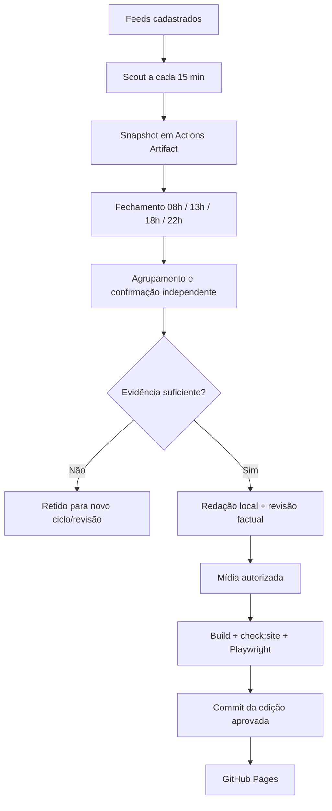

# APURANTE.

**Informação que vai além da manchete.** Portal editorial estático sobre Brasil e mundo, com fontes identificadas, texto original, múltiplas rotas de verificação e automação conservadora.

## Estado atual

- Frontend em Astro, hospedado no GitHub Pages.
- Editorias: Brasil, Mundo, Política, Economia, Tecnologia, Ciência, Cultura, Esportes, Saúde e Meio Ambiente.
- Quatro fechamentos editoriais regulares por dia: **08h, 13h, 18h e 22h**, no fuso `America/Sao_Paulo`.
- Edições extraordinárias podem ser publicadas fora da grade sem consumir o próximo fechamento regular.
- O Scout observa fontes a cada 15 minutos e **não publica nem faz commits no `main`**.
- O estado transitório do Scout circula por GitHub Actions Artifacts imutáveis e validados.
- O fechamento editorial consome apenas o último snapshot válido, verifica evidências, gera matérias, valida o site e só então registra uma edição aprovada.
- APURANTE+ funciona no navegador, sem cadastro ou backend, com preferências locais, Ler Depois e backup `.apurante`.

Produção pública: `https://humbertomennella.github.io/framenexo/`

## Arquitetura editorial



O Scout é deliberadamente simples. A inteligência editorial mais cara fica concentrada nos fechamentos. Uma fonte indisponível degrada a coleta, mas não apaga o pool nem autoriza conteúdo sem confirmação.

## Stack

- Astro 7.3.1
- TypeScript 7.0.2
- Node.js 24+
- Python 3.12+ no pipeline editorial
- Playwright 1.63
- llama.cpp + Qwen3-4B local para redação e revisão factual
- GitHub Actions + GitHub Pages

Não há API paga de IA no pipeline atual.

## Instalação e testes

```bash
npm ci
npm test
npm run build
npm run check:site
npm run test:ui
```

O build não precisa do modelo local. O pipeline editorial completo precisa do ambiente Linux usado pelos workflows e do modelo configurado em `data/model-lock.json`.

## Scout

Execução local:

```bash
npm run scout
```

O Scout:

1. recupera o último snapshot válido quando executado no Actions;
2. coleta feeds habilitados;
3. normaliza e valida URLs;
4. rejeita conteúdo hostil, futuro ou expirado;
5. limita concentração por organização;
6. grava somente o snapshot transitório em `.cache/scout/`;
7. no GitHub Actions, envia esse snapshot como Artifact com retenção curta.

O Scout **não tem permissão para publicar, fazer commit ou disparar deploy**.

## Fechamento editorial

```bash
# respeita a janela regular atual
python3 scripts/run_editorial.py

# edição extraordinária, sem relaxar critérios de qualidade
python3 scripts/run_editorial.py --force

# ensaio sem publicação
python3 scripts/run_editorial.py --force --dry-run --limit 1
```

Uma matéria completa nova exige, como regra atual, duas organizações independentes sustentando o mesmo núcleo factual. Republicações de uma mesma apuração contam como uma rota. Rumores, opinião, conteúdo promocional, conflito factual e evidência insuficiente são retidos.

O modelo recebe as fontes como dados não confiáveis e não possui ferramentas, shell ou credenciais. O texto passa por validações de formato, extensão, números, cópia, idioma, evidência e duplicação. Uma segunda passagem do mesmo modelo ajuda na revisão factual, mas **não equivale a confirmação independente**.

A aquisição automática de mídia ocorre somente depois que o texto passa pela verificação. Mídia de terceiros precisa de licença explícita e registro em `data/image-rights.json`. Falha de mídia mantém a pauta retida.

## Publicação

O fechamento regular é agendado no GitHub em UTC:

- `11:00 UTC` → 08h Brasília
- `16:00 UTC` → 13h Brasília
- `21:00 UTC` → 18h Brasília
- `01:00 UTC` → 22h Brasília do dia anterior

O cron configurado é:

```text
0 1,11,16,21 * * *
```

`data/edition-schedule.json` é a fonte de configuração dos slots e do fuso.

O workflow só deve fazer commit quando houver alteração real em `content/news/`. Dados transitórios de coleta e diagnóstico não constituem uma edição e não devem criar commits no `main`.

## Estrutura principal

| Caminho | Função |
|---|---|
| `content/news/` | Matérias publicadas e permanentes |
| `data/sources.json` | Cadastro e política técnica das fontes |
| `data/publishing-state.json` | Estado durável de publicação |
| `data/evidence/` | Auditoria factual das matérias geradas pelo pipeline |
| `data/image-rights.json` | Origem e licença dos ativos editoriais |
| `data/edition-schedule.json` | Grade de 08h, 13h, 18h e 22h |
| `scripts/run_scout.py` | Coleta transitória |
| `scripts/scout_snapshot.py` | Transporte e validação do snapshot |
| `scripts/run_editorial.py` | Orquestração do fechamento |
| `scripts/publish_edition.py` | Geração e registro da edição |
| `.github/workflows/scout.yml` | Scout de 15 minutos |
| `.github/workflows/collector.yml` | Fechamentos regulares/reutilizáveis |
| `.github/workflows/publisher.yml` | Edição extraordinária manual |
| `.github/workflows/deploy.yml` | Build, testes e GitHub Pages |

`.cache/`, `node_modules/`, `dist/`, relatórios de teste e arquivos de ambiente ficam fora do Git.

## Validação

Antes de uma publicação, o pipeline executa:

1. testes Python e JavaScript;
2. `npm run build`;
3. `npm run check:site`;
4. instalação do Chromium no runner;
5. `npm run test:ui` com Playwright;
6. commit somente após a validação.

`check:site` valida, entre outros pontos, títulos, H1, canonical, descrições, links internos, imagens, JSON-LD, sitemap, robots, índice de busca, diversidade mínima do acervo, regras de fontes e extensão das matérias.

## APURANTE+

APURANTE+ é uma camada pessoal gratuita e local. Não é assinatura, plano Premium nem conta de usuário.

- armazenamento no `localStorage`;
- preferências e organização da Home;
- assuntos seguidos;
- Ler Depois;
- backup único `.apurante`;
- criptografia opcional no navegador;
- sem sincronização oculta entre dispositivos.

## Operação

**Pausar publicação:** altere o estado durável de publicação ou desabilite o workflow de fechamento. O Scout pode continuar coletando porque coleta e publicação são responsabilidades separadas.

**Publicação extraordinária:** Actions → `Publicação manual` → Run workflow. `force` ignora somente o relógio; não ignora verificação, pausa, evidência ou mídia.

**Adicionar fonte:** registre organização, URL, feed, hosts, tipo, papel editorial e categoria em `data/sources.json`. Somente habilite feeds que possam ser lidos de forma compatível com os termos e limites do provedor.

**Corrigir matéria:** preserve `publishedAt`, atualize `updatedAt` e acrescente uma entrada em `corrections` quando a mudança for factual ou alterar a interpretação do registro.

**Falha de fonte:** é registrada como degradação parcial. O sistema não contorna autenticação, CAPTCHA, paywall ou bloqueios do provedor.

## Segurança

- HTTPS e hosts explicitamente permitidos;
- bloqueio de IPs privados e redirecionamentos fora da lista;
- limite de tamanho e timeout de fontes;
- proteção contra DTD/XXE e padrões conhecidos de prompt injection;
- modelo local somente em loopback;
- Actions externas fixadas por SHA;
- checkout sem credenciais persistentes;
- Scout com `contents: read`;
- token de escrita restrito ao job que salva uma edição aprovada;
- snapshots validados por versão, origem, idade, run e SHA-256.

Consulte `docs/SEGURANCA.md`, `docs/scout-artifacts.md` e `docs/editorial-publication-flow.md` para os detalhes operacionais.
